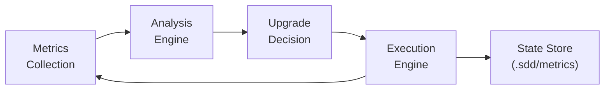
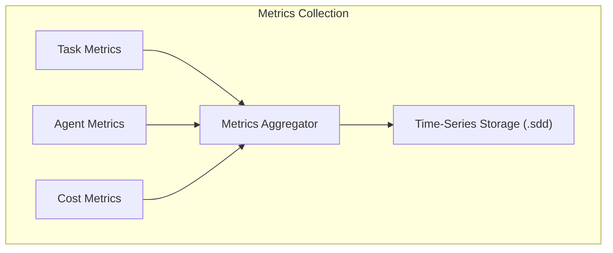
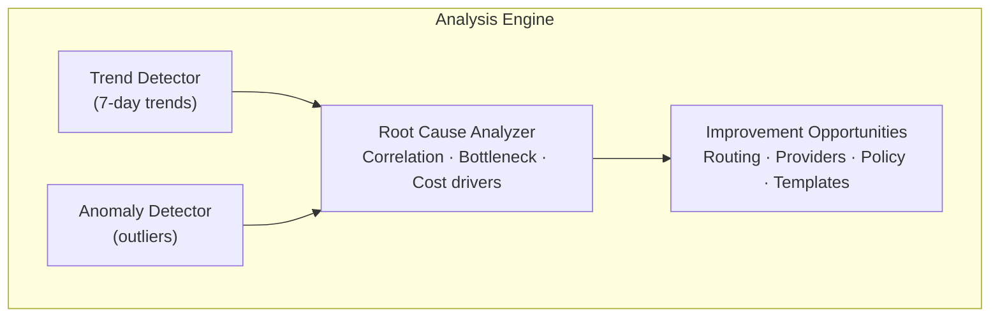
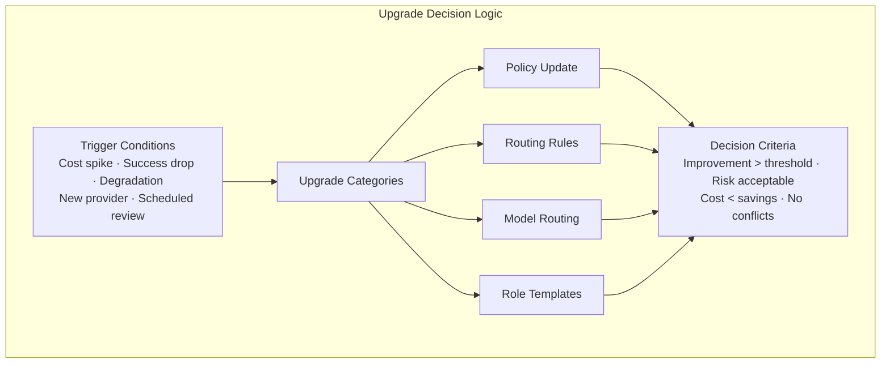
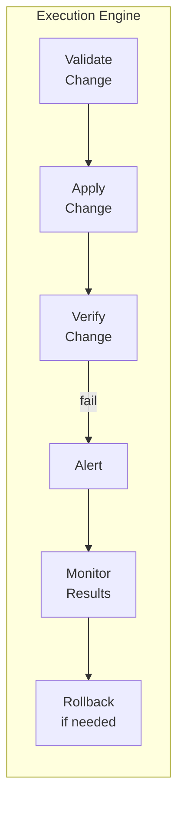

# ADR-003: Self-Evolution Feedback Loop Architecture

**Status**: Approved
**Date**: 2026-03-22
**Author**: Bernstein Architecture Team
**Context**: Self-improving multi-agent orchestration system

---

## Problem Statement

Bernstein orchestrates multiple LLM agents working on software development tasks. Without a feedback mechanism:

1. **Performance degradation goes undetected** - Agent success rates drop, costs increase, but no automatic correction occurs
2. **Improvement opportunities are missed** - Better model routing, policy adjustments, and prompt optimizations require manual analysis
3. **System stagnation** - The system cannot adapt to changing conditions (new providers, API changes, project evolution)
4. **Reactive rather than proactive** - Humans must notice problems and manually fix them

---

## Requirements

1. **Automatic metrics collection** - Track task success, cost, latency, token usage, provider health
2. **Performance analysis** - Detect trends, anomalies, and bottlenecks
3. **Upgrade decision logic** - Determine when and how to improve the system
4. **Safe execution** - Apply changes with rollback capability
5. **Continuous operation** - Run in background without human intervention

---

## Architecture



### Component 1: Metrics Collection



**Task Metrics:**
- `task_duration_seconds`: Time from spawn to completion
- `task_success_rate`: Percentage passing janitor verification
- `task_rework_rate`: Percentage requiring fix tasks
- `task_token_usage`: Total tokens consumed
- `task_cost_usd`: Dollar cost per task
- `files_modified`: Number of files changed
- `lines_added_deleted`: Code churn metrics

**Agent Metrics:**
- `agent_lifetime_seconds`: Session duration
- `agent_tasks_completed`: Tasks per session
- `agent_heartbeat_failures`: Times heartbeat was missed
- `agent_sleep_incidents`: Times agent stopped responding
- `agent_context_tokens`: Context window utilization

**Cost Metrics:**
- `cost_per_provider`: USD spent per LLM provider
- `cost_per_role`: USD spent per agent role
- `cost_per_task`: Average cost per completed task
- `free_tier_utilization`: Percentage using free tiers
- `budget_remaining`: Remaining budget for billing period

**Quality Metrics:**
- `janitor_pass_rate`: First-pass verification success
- `human_approval_rate`: Percentage accepted without review
- `rollback_rate`: Percentage of changes reverted
- `test_pass_rate`: Automated test success rate

**Provider Health Metrics:**
- `provider_status`: healthy/degraded/unhealthy/rate_limited
- `provider_latency_ms`: Average response time
- `provider_error_rate`: Percentage of failed requests
- `quota_remaining`: Free tier quota left

### Component 2: Analysis Engine



**Analysis Algorithms:**

1. **Trend Detection**
   - Rolling average comparison (current vs 7-day baseline)
   - Linear regression for cost/performance trends
   - Change-point detection for sudden shifts

2. **Anomaly Detection**
   - Z-score based outlier detection (threshold: |z| > 2.5)
   - Isolation forest for multi-variate anomalies
   - Threshold-based alerts (e.g., cost spike > 50%)

3. **Correlation Analysis**
   - Pearson correlation between metrics
   - Identifies relationships (e.g., model choice → success rate)
   - Surfaces hidden dependencies

4. **Bottleneck Identification**
   - Queue depth analysis per role
   - Agent utilization rates
   - Task completion rate by complexity

### Component 3: Upgrade Decision Logic



**Trigger Conditions:**

| Trigger | Threshold | Action |
|---------|-----------|--------|
| Cost spike | >50% increase in 24h | Immediate review |
| Success rate drop | <80% for 10+ tasks | Model routing adjustment |
| Free tier available | New provider detected | Policy update |
| Budget threshold | >80% of monthly budget | Cost optimization |
| Scheduled review | Weekly/Monthly | Full system analysis |

**Upgrade Categories:**

1. **Policy Updates** (Low Risk)
   - Adjust provider switching thresholds
   - Modify batch sizes
   - Update rate limit configurations

2. **Routing Rules** (Medium Risk)
   - Change model selection criteria
   - Add/remove provider preferences
   - Adjust effort level mappings

3. **Model Routing** (Medium Risk)
   - Switch default models for roles
   - Update complexity thresholds
   - Add new model providers

4. **Role Templates** (High Risk)
   - Update system prompts
   - Modify task prompt templates
   - Change role configurations

### Component 4: Execution Engine



**Execution Flow:**

1. **Validation**
   - Syntax check for YAML/JSON policy changes
   - Dry-run simulation for routing changes
   - Backward compatibility verification

2. **Application**
   - Atomic file writes with rollback capability
   - Version control integration (git commit per change)
   - Notification to running agents

3. **Verification**
   - Immediate metric check (did things improve?)
   - A/B comparison with baseline
   - Rollback trigger if degradation detected

4. **Monitoring**
   - Watch key metrics for 24h post-change
   - Alert on unexpected side effects
   - Log all changes for audit trail

---

## Data Flow

```
Task Completion
       │
       ▼
┌──────────────┐
│  Janitor     │───▶ Pass/Fail + Metrics
└──────────────┘
       │
       ▼
┌──────────────┐
│  Metrics     │───▶ Append to .sdd/metrics/tasks.jsonl
│  Collector   │
└──────────────┘
       │
       ▼
┌──────────────┐
│  Analysis    │───▶ Run every N tasks or T minutes
│  Scheduler   │
└──────────────┘
       │
       ▼
┌──────────────┐
│  Analysis    │───▶ Identify patterns
│  Engine      │
└──────────────┘
       │
       ▼
┌──────────────┐
│  Upgrade     │───▶ Decide on changes
│  Decision    │
└──────────────┘
       │
       ▼
┌──────────────┐
│  Execution   │───▶ Apply + Verify
│  Engine      │
└──────────────┘
       │
       ▼
┌──────────────┐
│  Git Commit  │───▶ Track changes
│  + Notify    │
└──────────────┘
```

---

## State Storage

All state lives in `.sdd/` directory:

```
.sdd/
├── metrics/
│   ├── tasks.jsonl          # Per-task metrics (append-only)
│   ├── agents.jsonl         # Per-agent session metrics
│   ├── costs.jsonl          # Cost tracking per provider
│   └── quality.jsonl        # Quality metrics (janitor, tests)
├── analysis/
│   ├── trends.json          # 7-day rolling trends
│   ├── anomalies.json       # Detected anomalies
│   └── opportunities.json   # Improvement suggestions
├── upgrades/
│   ├── pending.json         # Upgrades awaiting approval
│   ├── applied.json         # Recently applied upgrades
│   └── history.jsonl        # Full upgrade history
└── config/
    ├── policies.yaml        # Active policies
    ├── routing.yaml         # Model routing rules
    └── providers.yaml       # Provider configurations
```

---

## Metrics Schema

**Task Metrics Record:**
```json
{
  "timestamp": "2026-03-22T10:30:00Z",
  "task_id": "PROJ-042",
  "role": "backend",
  "model": "sonnet",
  "provider": "openrouter",
  "duration_seconds": 180,
  "tokens_prompt": 2500,
  "tokens_completion": 1200,
  "cost_usd": 0.0045,
  "janitor_passed": true,
  "files_modified": 3,
  "lines_added": 45,
  "lines_deleted": 12
}
```

**Provider Cost Record:**
```json
{
  "timestamp": "2026-03-22T10:30:00Z",
  "provider": "openrouter",
  "model": "sonnet",
  "tier": "paid",
  "tokens_in": 2500,
  "tokens_out": 1200,
  "cost_usd": 0.0045,
  "rate_limit_remaining": 950,
  "free_tier_remaining": 0
}
```

---

## Upgrade Approval Modes

| Mode | Description | Use Case |
|------|-------------|----------|
| Auto | Apply immediately | Low-risk policy tweaks |
| Human | Require approval | High-risk template changes |
| Hybrid | Auto if confidence >90%, else human | Most upgrades |

---

## Implementation: EvolutionCoordinator

The `EvolutionCoordinator` class in `src/bernstein/core/evolution.py` implements this architecture:

```python
coordinator = EvolutionCoordinator(
    router=tier_aware_router,
    hijacker=tier_hijacker,
    metrics_collector=metrics_collector,
    config=EvolutionConfig(
        evaluation_interval_minutes=30,
        min_tasks_for_evaluation=5,
        auto_execute_low_priority=False,
    ),
)

coordinator.start()  # Background evaluation loop
```

**Key responsibilities:**
1. Periodic performance evaluation (every 30 minutes)
2. Metrics aggregation and trend analysis
3. Upgrade recommendation generation
4. Task creation for implementation
5. History tracking for impact measurement

---

## Alternatives Considered

### Option A: Manual-only improvements
Humans analyze metrics and manually apply fixes.

**Pros:** Full control, no automation risk
**Cons:** Slow, reactive, requires constant human attention

**Verdict:** Rejected. Defeats the purpose of self-evolution.

### Option B: Full auto-pilot
System makes and applies all changes automatically.

**Pros:** Maximum automation, rapid iteration
**Cons:** Risk of cascading errors, hard to debug

**Verdict:** Rejected for high-risk changes. Accepted for low-risk policy tweaks.

### Option C: Hybrid (chosen)
Automatic analysis + human approval for high-risk changes.

**Pros:** Best balance of automation and control
**Cons:** Requires human involvement for major changes

**Verdict:** Selected. Low-risk changes (policy tweaks) auto-apply. High-risk changes (prompt modifications) require approval.

---

## Consequences

### Positive
- **Continuous improvement** - System gets better over time without manual intervention
- **Early problem detection** - Anomalies caught before they become critical
- **Cost optimization** - Automatic switching to cheaper providers when possible
- **Performance tuning** - Router thresholds adjust based on real data

### Risks
- **Over-optimization** - System might optimize for metrics at expense of quality
- **Change fatigue** - Too many automatic changes could destabilize development
- **Debugging complexity** - Harder to trace why a change was made

### Mitigations
- **Confidence thresholds** - Only apply changes with >80% confidence
- **Rate limiting** - Maximum 2 concurrent upgrades
- **Audit trail** - All changes logged with rationale
- **Rollback capability** - Automatic revert if metrics degrade

---

## References

- Implementation: `src/bernstein/core/evolution.py`
- Metrics: `src/bernstein/core/metrics.py`
- Policy Engine: `src/bernstein/core/policy.py`
