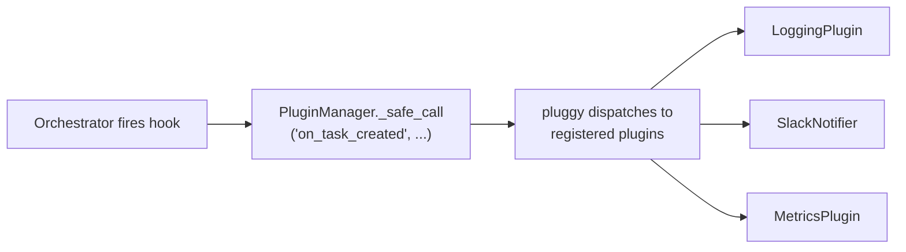

# Bernstein Plugin SDK

Bernstein exposes a pluggy-based hook system that lets you extend the
orchestrator without modifying core code.  Plugins are plain Python classes
- no base class required, no registration boilerplate.

## Contents

- [How it works](#how-it-works)
- [Writing a plugin](#writing-a-plugin)
- [Available hooks](#available-hooks)
- [Installing a plugin](#installing-a-plugin)
- [Error isolation](#error-isolation)
- [Example plugins](#example-plugins)
  - [Logging notifier](#logging-notifier)
  - [Slack notifier](#slack-notifier)
  - [Discord notifier](#discord-notifier)
  - [Metrics collector](#metrics-collector)
  - [Custom quality gate](#custom-quality-gate)
  - [Cost-aware router](#cost-aware-router)
  - [Jira sync](#jira-sync)
  - [Linear sync](#linear-sync)
- [Provider routing customization](#provider-routing-customization)
- [Testing plugins](#testing-plugins)
- [Packaging a plugin for distribution](#packaging-a-plugin-for-distribution)
- [Introspection](#introspection)

---

## How it works

Bernstein uses [pluggy](https://pluggy.readthedocs.io/) - the same hook
machinery used by pytest.  The orchestrator fires named hooks at key points in
the task and agent lifecycle.  Any installed plugin that implements a hook
receives the call automatically.



All hook calls are **fire-and-forget**: exceptions raised by a plugin are
caught, logged, and discarded.  A misbehaving plugin cannot crash the
orchestrator.

---

## Writing a plugin

A plugin is a Python class whose methods are decorated with `@hookimpl`.

```python
from bernstein.plugins import hookimpl


class MyPlugin:
    @hookimpl
    def on_task_completed(self, task_id: str, role: str, result_summary: str) -> None:
        print(f"Task {task_id} done: {result_summary}")
```

Rules:

- **Decorate with `@hookimpl`** - unmarked methods are ignored.
- **Use keyword arguments** - hooks are always called with `**kwargs`, so you
  may safely omit parameters you don't need.
- **Return `None`** - return values from hook implementations are ignored.
- **Don't block** - hooks run synchronously in the orchestrator's main loop.
  Offload slow I/O (HTTP, DB writes) to a background thread or queue.

---

## Available hooks

The table below covers the most commonly used hooks. It is a curated
subset; the full set (40+ hooks) is defined in
`src/bernstein/plugins/hookspecs.py`, which is the canonical contract.

| Hook | When fired | Parameters |
|------|-----------|------------|
| `on_task_created` | Immediately after a task is added to the task server | `task_id`, `role`, `title` |
| `on_task_completed` | When a task transitions to `done` | `task_id`, `role`, `result_summary` |
| `on_task_failed` | When a task transitions to `failed` | `task_id`, `role`, `error` |
| `on_agent_spawned` | Right after a new agent session is started | `session_id`, `role`, `model` |
| `on_agent_reaped` | When an agent session is collected by the janitor | `session_id`, `role`, `outcome` |
| `on_evolve_proposal` | When an evolution proposal receives a verdict | `proposal_id`, `title`, `verdict` |

### Parameter reference

**`on_task_created`**

| Parameter | Type | Description |
|-----------|------|-------------|
| `task_id` | `str` | Unique task identifier (e.g. `"a468891b59b5"`) |
| `role` | `str` | Agent role assigned (e.g. `"backend"`, `"qa"`) |
| `title` | `str` | Human-readable task title |

**`on_task_completed`**

| Parameter | Type | Description |
|-----------|------|-------------|
| `task_id` | `str` | Unique task identifier |
| `role` | `str` | Role that completed the task |
| `result_summary` | `str` | Short description of what was accomplished |

**`on_task_failed`**

| Parameter | Type | Description |
|-----------|------|-------------|
| `task_id` | `str` | Unique task identifier |
| `role` | `str` | Role that was working the task |
| `error` | `str` | Error message or failure reason |

**`on_agent_spawned`**

| Parameter | Type | Description |
|-----------|------|-------------|
| `session_id` | `str` | Unique agent session identifier |
| `role` | `str` | Agent role |
| `model` | `str` | Model identifier (e.g. `"claude-sonnet-4-6"`) |

**`on_agent_reaped`**

| Parameter | Type | Description |
|-----------|------|-------------|
| `session_id` | `str` | Unique agent session identifier |
| `role` | `str` | Agent role |
| `outcome` | `str` | Outcome string: `"completed"`, `"timed_out"`, `"failed"` |

**`on_evolve_proposal`**

| Parameter | Type | Description |
|-----------|------|-------------|
| `proposal_id` | `str` | Unique proposal identifier |
| `title` | `str` | Proposal title |
| `verdict` | `str` | Final verdict: `"accepted"`, `"rejected"`, `"deferred"` |

---

## Installing a plugin

There are two ways to load a plugin.

### Option A: `bernstein.yaml` (per-project)

Add a `plugins:` list to your `bernstein.yaml`.  Each entry is a dotted import
path, optionally with a colon separating the module from the class name.

```yaml
# bernstein.yaml
plugins:
  - my_package.hooks:SlackNotifier
  - my_package.hooks:MetricsPlugin
```

Bernstein imports the module, instantiates the class, and registers it at
startup.  The package must be importable in the Python environment where
`bernstein run` is executed.

### Option B: entry points (distributable plugins)

Register a `bernstein.plugins` entry point in `pyproject.toml`.  This makes
the plugin auto-load whenever it is installed alongside Bernstein - no
`bernstein.yaml` change required.

```toml
[project.entry-points."bernstein.plugins"]
slack = "my_package.hooks:SlackNotifier"
metrics = "my_package.hooks:MetricsPlugin"
```

Entry points that point to a **class** are instantiated automatically.  Entry
points that point to a **module** are registered as-is.

---

## Error isolation

Every hook call is wrapped in a `try/except` inside `PluginManager._safe_call`.
If your plugin raises an exception it will be:

1. Logged at `WARNING` level.
2. Silently discarded - the orchestrator continues normally.

This means plugin authors can be liberal with exceptions; they won't take down
the system.  However, it also means silent failures are possible, so log
liberally inside your plugins.

---

## Example plugins

### Logging notifier

`examples/plugins/logging_plugin.py` - ships with Bernstein.  Prints every
lifecycle event to stdout; useful as a starting template.

```python
from bernstein.plugins import hookimpl


class LoggingPlugin:
    """Prints all lifecycle events to stdout."""

    @hookimpl
    def on_task_created(self, task_id: str, role: str, title: str) -> None:
        print(f"[plugin] Task {task_id} ({role}) created: {title}")

    @hookimpl
    def on_task_completed(self, task_id: str, role: str, result_summary: str) -> None:
        print(f"[plugin] Task {task_id} ({role}) completed: {result_summary}")

    @hookimpl
    def on_task_failed(self, task_id: str, role: str, error: str) -> None:
        print(f"[plugin] Task {task_id} ({role}) FAILED: {error}")

    @hookimpl
    def on_agent_spawned(self, session_id: str, role: str, model: str) -> None:
        print(f"[plugin] Agent spawned: session={session_id} role={role} model={model}")

    @hookimpl
    def on_agent_reaped(self, session_id: str, role: str, outcome: str) -> None:
        print(f"[plugin] Agent reaped: session={session_id} role={role} outcome={outcome}")

    @hookimpl
    def on_evolve_proposal(self, proposal_id: str, title: str, verdict: str) -> None:
        print(f"[plugin] Evolve proposal {proposal_id} ({title!r}): {verdict}")
```

Enable it:

```yaml
# bernstein.yaml
plugins:
  - examples.plugins.logging_plugin:LoggingPlugin
```

---

### Slack notifier

`examples/plugins/slack_notifier.py` - posts failure and completion alerts to
a Slack channel via an Incoming Webhook.

The HTTP request is dispatched on a daemon thread so the hook never blocks the
orchestrator loop.  Only implements the three highest-signal hooks; others are
simply not defined (which is fine - pluggy ignores them).

```python
from __future__ import annotations

import json
import logging
import os
import threading
import urllib.request
from typing import Any

from bernstein.plugins import hookimpl

log = logging.getLogger(__name__)


class SlackNotifier:
    """Posts task failure and key-event alerts to Slack.

    Configure via environment variable:
        export SLACK_WEBHOOK_URL=https://hooks.slack.com/services/T.../B.../xxx
    """

    def __init__(self, webhook_url: str | None = None) -> None:
        self._webhook_url = webhook_url or os.getenv("SLACK_WEBHOOK_URL", "")
        if not self._webhook_url:
            log.warning(
                "SlackNotifier: no webhook URL configured - "
                "set SLACK_WEBHOOK_URL or pass webhook_url= at construction time"
            )

    @hookimpl
    def on_task_failed(self, task_id: str, role: str, error: str) -> None:
        """Alert on task failure - highest-signal event for on-call."""
        self._post(
            {
                "text": f":red_circle: *Task failed* `{task_id}` (role: `{role}`)\n```{error[:500]}```",
            }
        )

    @hookimpl
    def on_task_completed(self, task_id: str, role: str, result_summary: str) -> None:
        """Optional: notify on completion (disable if too noisy)."""
        self._post(
            {
                "text": f":white_check_mark: Task `{task_id}` completed by `{role}`: {result_summary[:200]}",
            }
        )

    @hookimpl
    def on_evolve_proposal(self, proposal_id: str, title: str, verdict: str) -> None:
        """Notify when an evolution proposal is accepted or rejected."""
        emoji = ":tada:" if verdict == "accepted" else ":no_entry_sign:"
        self._post(
            {
                "text": f"{emoji} Evolution proposal `{proposal_id}` *{verdict}*: {title}",
            }
        )

    def _post(self, payload: dict[str, Any]) -> None:
        """Dispatch a Slack webhook call on a background daemon thread."""
        if not self._webhook_url:
            return
        url = self._webhook_url

        def _send() -> None:
            try:
                data = json.dumps(payload).encode()
                req = urllib.request.Request(
                    url,
                    data=data,
                    headers={"Content-Type": "application/json"},
                    method="POST",
                )
                with urllib.request.urlopen(req, timeout=5):
                    pass
            except Exception as exc:
                log.warning("SlackNotifier: failed to post webhook: %s", exc)

        threading.Thread(target=_send, daemon=True).start()
```

Enable it:

```yaml
# bernstein.yaml
plugins:
  - examples.plugins.slack_notifier:SlackNotifier
```

```bash
export SLACK_WEBHOOK_URL=https://hooks.slack.com/services/T.../B.../xxx
```

---

### Discord notifier

`examples/plugins/discord_notifier.py` - posts alerts to a Discord channel
via a Webhook URL.  Uses Discord's embed format for color-coded messages.

```python
from __future__ import annotations

import json
import logging
import os
import threading
import urllib.request
from typing import Any

from bernstein.plugins import hookimpl

log = logging.getLogger(__name__)


class DiscordNotifier:
    """Posts task failure and completion alerts to Discord.

    Configure via environment variable:
        export DISCORD_WEBHOOK_URL=https://discord.com/api/webhooks/CHANNEL_ID/TOKEN
    """

    def __init__(self, webhook_url: str | None = None) -> None:
        self._webhook_url = webhook_url or os.getenv("DISCORD_WEBHOOK_URL", "")
        if not self._webhook_url:
            log.warning(
                "DiscordNotifier: no webhook URL configured - "
                "set DISCORD_WEBHOOK_URL or pass webhook_url= at construction time"
            )

    @hookimpl
    def on_task_failed(self, task_id: str, role: str, error: str) -> None:
        self._post(
            embeds=[
                {
                    "title": f"Task Failed: {task_id}",
                    "description": f"**Role:** `{role}`\n```{error[:800]}```",
                    "color": 0xED4245,  # Discord red
                }
            ]
        )

    @hookimpl
    def on_task_completed(self, task_id: str, role: str, result_summary: str) -> None:
        self._post(
            embeds=[
                {
                    "title": f"Task Completed: {task_id}",
                    "description": f"**Role:** `{role}`\n{result_summary[:400]}",
                    "color": 0x57F287,  # Discord green
                }
            ]
        )

    @hookimpl
    def on_evolve_proposal(self, proposal_id: str, title: str, verdict: str) -> None:
        color = 0x57F287 if verdict == "accepted" else 0xED4245
        self._post(
            embeds=[
                {
                    "title": f"Evolution Proposal {verdict.title()}: {title}",
                    "description": f"Proposal ID: `{proposal_id}`",
                    "color": color,
                }
            ]
        )

    def _post(self, embeds: list[dict[str, Any]]) -> None:
        """Dispatch Discord webhook on a background daemon thread."""
        if not self._webhook_url:
            return
        url = self._webhook_url
        payload: dict[str, Any] = {"embeds": embeds}

        def _send() -> None:
            try:
                data = json.dumps(payload).encode()
                req = urllib.request.Request(
                    url,
                    data=data,
                    headers={"Content-Type": "application/json"},
                    method="POST",
                )
                with urllib.request.urlopen(req, timeout=5):
                    pass
            except Exception as exc:
                log.warning("DiscordNotifier: failed to post webhook: %s", exc)

        threading.Thread(target=_send, daemon=True).start()
```

Enable it:

```yaml
# bernstein.yaml
plugins:
  - examples.plugins.discord_notifier:DiscordNotifier
```

```bash
export DISCORD_WEBHOOK_URL=https://discord.com/api/webhooks/CHANNEL_ID/TOKEN
```

---

### Metrics collector

`examples/plugins/metrics_plugin.py` - appends structured JSON events to
`.sdd/metrics/plugin_events.jsonl` for every hook that fires.  Use it as a
foundation for custom dashboards or feeding data into an observability platform.

```python
from __future__ import annotations

import json
import logging
import os
from datetime import UTC, datetime
from pathlib import Path
from typing import Any

from bernstein.plugins import hookimpl

log = logging.getLogger(__name__)


class MetricsPlugin:
    """Writes all lifecycle events to a JSONL metrics file.

    Each line: {"ts": "ISO8601", "event": "task_created", ...fields...}

    Override the output directory:
        export BERNSTEIN_METRICS_DIR=/path/to/metrics
    """

    def __init__(self, metrics_dir: Path | str | None = None) -> None:
        if metrics_dir is not None:
            self._metrics_dir = Path(metrics_dir)
        elif env := os.getenv("BERNSTEIN_METRICS_DIR"):
            self._metrics_dir = Path(env)
        else:
            self._metrics_dir = Path.cwd() / ".sdd" / "metrics"

    @hookimpl
    def on_task_created(self, task_id: str, role: str, title: str) -> None:
        self._write("task_created", task_id=task_id, role=role, title=title)

    @hookimpl
    def on_task_completed(self, task_id: str, role: str, result_summary: str) -> None:
        self._write("task_completed", task_id=task_id, role=role, result_summary=result_summary)

    @hookimpl
    def on_task_failed(self, task_id: str, role: str, error: str) -> None:
        self._write("task_failed", task_id=task_id, role=role, error=error)

    @hookimpl
    def on_agent_spawned(self, session_id: str, role: str, model: str) -> None:
        self._write("agent_spawned", session_id=session_id, role=role, model=model)

    @hookimpl
    def on_agent_reaped(self, session_id: str, role: str, outcome: str) -> None:
        self._write("agent_reaped", session_id=session_id, role=role, outcome=outcome)

    @hookimpl
    def on_evolve_proposal(self, proposal_id: str, title: str, verdict: str) -> None:
        self._write("evolve_proposal", proposal_id=proposal_id, title=title, verdict=verdict)

    def _write(self, event: str, **fields: Any) -> None:
        record: dict[str, Any] = {
            "ts": datetime.now(UTC).isoformat(),
            "event": event,
            **fields,
        }
        try:
            self._metrics_dir.mkdir(parents=True, exist_ok=True)
            with (self._metrics_dir / "plugin_events.jsonl").open("a", encoding="utf-8") as f:
                f.write(json.dumps(record) + "\n")
        except OSError as exc:
            log.warning("MetricsPlugin: could not write event %r: %s", event, exc)
```

Enable it:

```yaml
# bernstein.yaml
plugins:
  - examples.plugins.metrics_plugin:MetricsPlugin
```

Sample output in `.sdd/metrics/plugin_events.jsonl`:

```json
{"ts": "2026-03-29T10:00:01+00:00", "event": "task_created", "task_id": "a468891b", "role": "backend", "title": "Implement auth middleware"}
{"ts": "2026-03-29T10:05:22+00:00", "event": "agent_spawned", "session_id": "s1a2b3c4", "role": "backend", "model": "claude-sonnet-4-6"}
{"ts": "2026-03-29T10:08:44+00:00", "event": "task_completed", "task_id": "a468891b", "role": "backend", "result_summary": "JWT auth middleware added"}
```

---

### Custom quality gate

`examples/plugins/quality_gate_plugin.py` - runs a security scan after every
task completes.

The gate result is written to `.sdd/metrics/custom_gates.jsonl`.  A failed
scan logs a warning but does **not** block the orchestrator - for hard
blocking, configure `quality_gates:` in `bernstein.yaml` instead.  The plugin
pattern is useful for **soft gates**: record the result, alert on failure, but
let the run continue.

```python
from __future__ import annotations

import json
import logging
import os
import subprocess
from datetime import UTC, datetime
from pathlib import Path

from bernstein.plugins import hookimpl

log = logging.getLogger(__name__)


class SecurityScanGate:
    """Runs a security scan (bandit) after every task completes.

    Override the scan command:
        export BERNSTEIN_SECURITY_CMD="semgrep --config=auto . --quiet"
    """

    def __init__(
        self,
        command: str | None = None,
        workdir: Path | str | None = None,
        timeout_s: int = 60,
    ) -> None:
        self._command = command or os.getenv("BERNSTEIN_SECURITY_CMD", "bandit -r . -ll -q")
        self._workdir = Path(workdir) if workdir else Path.cwd()
        self._timeout_s = timeout_s

    @hookimpl
    def on_task_completed(self, task_id: str, role: str, result_summary: str) -> None:
        passed, output = self._run_scan()
        self._record(task_id, passed, output)
        if not passed:
            log.warning(
                "SecurityScanGate: scan failed after task %s (%s):\n%s",
                task_id,
                role,
                output[:500],
            )

    def _run_scan(self) -> tuple[bool, str]:
        try:
            proc = subprocess.run(
                self._command,
                shell=True,
                cwd=self._workdir,
                capture_output=True,
                text=True,
                timeout=self._timeout_s,
            )
            out = (proc.stdout + proc.stderr).strip()
            if len(out) > 2000:
                out = out[:2000] + "\n... (truncated)"
            return proc.returncode == 0, out or "(no output)"
        except subprocess.TimeoutExpired:
            return False, f"Timed out after {self._timeout_s}s"
        except OSError as exc:
            return False, f"Command error: {exc}"

    def _record(self, task_id: str, passed: bool, output: str) -> None:
        metrics_dir = self._workdir / ".sdd" / "metrics"
        record = {
            "ts": datetime.now(UTC).isoformat(),
            "gate": "security_scan",
            "task_id": task_id,
            "command": self._command,
            "passed": passed,
            "output": output[:500],
        }
        try:
            metrics_dir.mkdir(parents=True, exist_ok=True)
            with (metrics_dir / "custom_gates.jsonl").open("a", encoding="utf-8") as f:
                f.write(json.dumps(record) + "\n")
        except OSError as exc:
            log.warning("SecurityScanGate: could not write result: %s", exc)
```

Enable it:

```yaml
# bernstein.yaml
plugins:
  - examples.plugins.quality_gate_plugin:SecurityScanGate
```

Replace `bandit` with any tool:

```bash
export BERNSTEIN_SECURITY_CMD="semgrep --config=auto . --quiet"
# or
export BERNSTEIN_SECURITY_CMD="trivy fs . --exit-code 1 --severity HIGH,CRITICAL"
```

---

### Cost-aware router

`examples/plugins/custom_router_plugin.py` - tracks cumulative model spend and
writes routing hints that the orchestrator reads on each scheduling tick.

This is the plugin pattern for influencing **model selection** without touching
`bernstein/core/router.py`.  The orchestrator reads
`.sdd/runtime/routing_hints.json` at startup and on each tick; if the file
does not exist, routing falls back to the standard tier-aware algorithm.

**How it works:**

1. `on_agent_spawned` - record the model alias for the new session.
2. `on_agent_reaped` - estimate token cost; accumulate against the daily budget.
3. At 60% budget consumed → keep `sonnet` as preferred model.
4. At 90% budget consumed → downgrade preferred model to `haiku`.
5. Protected roles (`manager`, `architect`, `security`) are never downgraded.

**Routing hints file** (`.sdd/runtime/routing_hints.json`):

```json
{
  "preferred_model": "haiku",
  "budget_remaining_usd": 0.83,
  "override_roles": {
    "manager": "opus",
    "architect": "opus"
  }
}
```

Enable it:

```yaml
# bernstein.yaml
plugins:
  - examples.plugins.custom_router_plugin:CostAwareRouter
```

Set the daily budget cap:

```bash
export BERNSTEIN_DAILY_BUDGET_USD=5.00   # default: 10.00
```

See `examples/plugins/custom_router_plugin.py` for the full source (~250 lines).

---

### Jira sync

`examples/plugins/jira_plugin.py` - keeps Jira issues and Bernstein tasks in
sync.  When a task completes or fails, the linked Jira issue is transitioned
accordingly and a comment is added on failure.

**Prerequisites:**

```bash
pip install bernstein-sdk[jira]
```

**Configuration:**

```yaml
# bernstein.yaml
plugins:
  - examples.plugins.jira_plugin:JiraPlugin
```

```bash
export JIRA_BASE_URL=https://your-org.atlassian.net
export JIRA_EMAIL=you@example.com
export JIRA_API_TOKEN=<token>
```

**How it works:**

The plugin reads `task.external_ref` to find the Jira issue key.  Set
`external_ref` to `"jira:PROJ-42"` when creating a task to link it.  If the
ref is absent or not prefixed with `jira:`, the plugin is a no-op for that task.

| Hook | Jira action |
|------|-------------|
| `on_task_completed` | Transition issue → Done |
| `on_task_failed` | Transition issue → Done (failed tag) + add error comment |
| `on_task_created` | Debug log only (no Jira call) |

All Jira API calls run on daemon threads - they never block the orchestrator.

**Custom status names:**

If your Jira project uses non-standard status names, register custom mappings
before `bernstein run`:

```python
from bernstein_sdk.state_map import BernsteinToJira, TaskStatus

BernsteinToJira.register(TaskStatus.DONE, "Shipped")
BernsteinToJira.register(TaskStatus.FAILED, "Blocked")
```

**Scope by role:**

To sync only tasks assigned to a specific role, pass `default_role=`:

```yaml
# bernstein.yaml
plugins:
  - my_hooks:JiraBackendPlugin   # a subclass or wrapper that sets default_role="backend"
```

Or configure it programmatically:

```python
from examples.plugins.jira_plugin import JiraPlugin
from bernstein.plugins.manager import get_plugin_manager

pm = get_plugin_manager()
pm.register(JiraPlugin(default_role="backend"), name="jira-backend")
```

---

### Linear sync

`examples/plugins/linear_plugin.py` - mirrors task state changes to Linear
issues via the Linear GraphQL API.

**Prerequisites:**

```bash
pip install bernstein-sdk
```

**Configuration:**

```yaml
# bernstein.yaml
plugins:
  - examples.plugins.linear_plugin:LinearPlugin
```

```bash
export LINEAR_API_KEY=lin_api_...
```

**How it works:**

Set `external_ref` to `"linear:ENG-42"` when creating a task.  The plugin maps
Bernstein task outcomes to Linear workflow states:

| Hook | Linear action |
|------|---------------|
| `on_task_completed` | Transition issue → Done |
| `on_task_failed` | Transition issue → Cancelled |
| `on_task_created` | Debug log only |

**Custom state mappings:**

```python
from bernstein_sdk.state_map import BernsteinToLinear, TaskStatus

BernsteinToLinear.register(TaskStatus.FAILED, "Blocked")
```

If no matching Linear state is found for an outcome, the plugin logs a warning
and leaves the issue unchanged.  This is safer than crashing or transitioning
to an unexpected state.

---

## Provider routing customization

The `TierAwareRouter` determines which AI provider (Anthropic, OpenAI,
Google, etc.) and which model handles each task.  It is separate from the
pluggy hook system and is configured via `providers.yaml`.

### How routing works

Each task is scored against registered providers using five factors:

| Factor | Weight | Description |
|--------|--------|-------------|
| Health (success rate) | 35% | Providers with recent failures score lower |
| Cost efficiency | 25% | Cheaper providers score higher |
| Free tier available | 20% | Free quota is preferred until exhausted |
| Latency | 10% | Lower average latency scores higher |
| Load spreading | 10% | Providers with fewer active agents score higher |

The router tries the preferred tier (default: `free`) first, then falls back
through `standard` → `premium`.

### Configuring providers via YAML

Create `.sdd/config/providers.yaml`:

```yaml
providers:
  anthropic_standard:
    tier: standard
    cost_per_1k_tokens: 0.003
    models:
      sonnet:
        model: claude-sonnet-4-6
        effort: high
      opus:
        model: claude-opus-4-7
        effort: max
    max_context_tokens: 200000
    supports_streaming: true
    supports_vision: false

  openrouter_free:
    tier: free
    cost_per_1k_tokens: 0.0
    free_tier_limit: 100          # requests per day
    models:
      sonnet:
        model: anthropic/claude-sonnet
        effort: high
    max_context_tokens: 128000

  google_ai:
    tier: standard
    cost_per_1k_tokens: 0.002
    models:
      gemini-pro:
        model: gemini-pro
        effort: high
    max_context_tokens: 128000
    supports_vision: true         # for tasks with image/diagram keywords

  ollama_local:
    tier: free
    cost_per_1k_tokens: 0.0
    models:
      sonnet:
        model: llama3.1
        effort: high
    max_context_tokens: 8000
    available: true               # set false to disable without removing
```

### Programmatic provider registration

```python
from bernstein.core.router import (
    TierAwareRouter,
    ProviderConfig,
    ModelConfig,
    Tier,
    get_default_router,
)

router = get_default_router()

# Add a local Ollama provider
router.register_provider(
    ProviderConfig(
        name="ollama_local",
        models={"sonnet": ModelConfig("llama3.1", "high")},
        tier=Tier.FREE,
        cost_per_1k_tokens=0.0,
        max_context_tokens=8_000,
    )
)

# Temporarily take a provider offline (e.g., during maintenance)
router.update_provider_availability("anthropic_standard", available=False)

# Record health signal after an observed failure
router.update_provider_health("anthropic_standard", success=False, latency_ms=30_000)
```

### Routing a task manually

```python
from bernstein.core.router import get_default_router
from bernstein.core.models import Task

router = get_default_router()
task = Task(id="t1", role="backend", title="Implement auth", ...)
decision = router.select_provider_for_task(task)

print(decision.provider)        # "anthropic_standard"
print(decision.model_config)    # ModelConfig(model="claude-sonnet-4-6", effort="high")
print(decision.tier)            # Tier.STANDARD
print(decision.estimated_cost)  # 0.0015
print(decision.fallback)        # False
```

### Combining the router with a plugin

Use a plugin (like `CostAwareRouter` above) to observe lifecycle events and
write routing hints.  Use `providers.yaml` to define which providers exist and
what they cost.  The two systems complement each other:

- `providers.yaml` - static configuration (endpoints, tiers, costs)
- Plugin hints file - dynamic overrides (budget pressure, runtime preferences)

---

## Testing plugins

Because plugins are plain Python classes you can unit-test them without
starting the orchestrator.

```python
from bernstein.plugins.manager import PluginManager
from my_package.hooks import SlackNotifier


def test_slack_notifier_on_failure(monkeypatch, capsys):
    calls = []

    def fake_post(url, json, timeout):
        calls.append(json)

    monkeypatch.setattr("requests.post", fake_post)

    pm = PluginManager()
    pm.register(SlackNotifier(webhook_url="https://example.com/hook"), name="slack")
    pm.fire_task_failed(task_id="abc123", role="backend", error="timeout")

    assert len(calls) == 1
    assert "abc123" in calls[0]["text"]
```

You can also drive the full hook machinery from a script without starting the
orchestrator:

```python
from bernstein.plugins.manager import PluginManager

pm = PluginManager()
pm.register(MyPlugin(), name="my-plugin")
pm.fire_task_created(task_id="t1", role="qa", title="Run integration tests")
```

---

## Packaging a plugin for distribution

To share a plugin as a pip-installable package:

```
my_bernstein_plugin/
├── pyproject.toml
└── src/
    └── my_bernstein_plugin/
        ├── __init__.py
        └── hooks.py
```

`pyproject.toml`:

```toml
[project]
name = "bernstein-plugin-example"
version = "0.1.0"
requires-python = ">=3.12"
dependencies = ["bernstein>=0.1"]

[project.entry-points."bernstein.plugins"]
example = "my_bernstein_plugin.hooks:MyPlugin"

[build-system]
requires = ["hatchling"]
build-backend = "hatchling.build"
```

Once installed (`pip install bernstein-plugin-example`), the plugin loads
automatically - no `bernstein.yaml` change required.

---

## Introspection

You can inspect which plugins are loaded and what hooks they implement:

```python
from bernstein.plugins.manager import get_plugin_manager

pm = get_plugin_manager()
print("Loaded plugins:", pm.registered_names)
for name in pm.registered_names:
    print(f"  {name}: {pm.plugin_hooks(name)}")
```

Example output:

```
Loaded plugins: ['slack', 'metrics']
  slack: ['on_task_failed']
  metrics: ['on_agent_reaped', 'on_agent_spawned', 'on_task_completed', 'on_task_created', 'on_task_failed']
```

Or list plugins installed into `.bernstein/plugins/` via the CLI:

```bash
bernstein plugins
```

```
              Installed Plugins
┌──────────┬─────────┬───────────┐
│ Name     │ Version │ Type      │
├──────────┼─────────┼───────────┤
│ metrics  │ 1.0     │ collector │
│ slack    │ 0.1     │ notifier  │
└──────────┴─────────┴───────────┘
```

The CLI lists plugins installed as directories under `.bernstein/plugins/<name>/meta.json`.
For hookimpl-registered plugins (loaded via `bernstein.yaml` or entry points), use the
Python API shown above.
